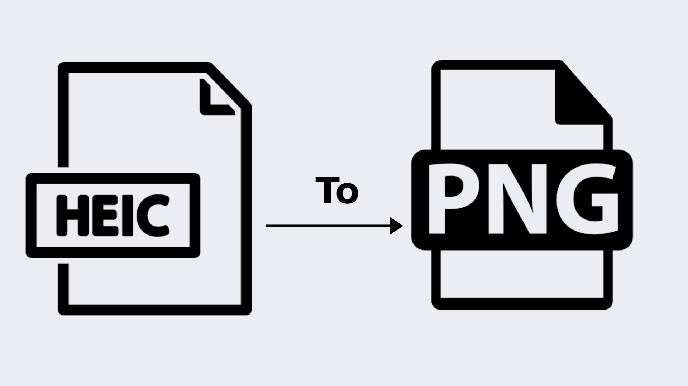

# HEIC to PNG Converter

This is a simple Python script that converts all HEIC files in a directory to PNG format. It uses the `pillow-heif` library to read the HEIC files and the `Pillow` library to save them as PNG files.



## Requirements

This script was tested with:

* Python `3.12.10`
* Windows 11
* `Pillow`
* `pillow-heif`

Install the Python dependencies by running:

```bash
pip install -r requirements.txt
```

You can check your Python version with:

```bash
python --version
```

Expected working version:

```bash
Python 3.12.10
```


## Usage

Run the script and pass the folder that contains your HEIC photos:

```bash
python main.py "C:\path\to\your\photos"
```

Example:

```bash
python main.py "C:\Users\user\Pictures\iPhone Photos"
```

To also save metadata sidecar files, add the `--metadata` flag:

```bash
python main.py "C:\Users\user\Pictures\iPhone Photos" --metadata
```

The script will automatically create a `converted-png-files` folder inside the selected folder and save the converted PNG files there.

Example result:

```text
iPhone Photos/
  IMG_001.HEIC
  IMG_002.HEIC
  converted-png-files/
    IMG_001.png
    IMG_002.png
```

When `--metadata` is used, each converted PNG also gets a `.metadata.json` sidecar file in the same folder:

```text
iPhone Photos/
  IMG_001.HEIC
  converted-png-files/
    IMG_001.png
    IMG_001.metadata.json
```

No manual output folder creation is needed.


## Notes

* The folder path is passed from the command line when running the script.
* The script automatically creates a `converted-png-files` folder inside the selected folder.
* Converted PNG files are saved in the `converted-png-files` folder.
* Metadata sidecar files are saved only when `--metadata` is used.
* Metadata may include sensitive information like GPS location, device model, and capture date/time.
* Original HEIC files are not modified or deleted.
* Folder paths with spaces should be wrapped in quotes.

Example:

```bash
python main.py "C:\Users\user\Pictures\iPhone Photos"
```

> [!NOTE]
> This script was developed and tested on Windows 11 using Python `3.12.10`.
